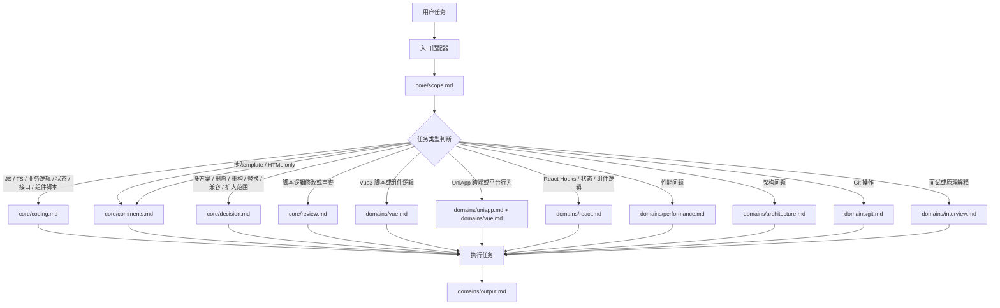

# AI Rules Framework

这是 Cursor、OpenCode、Claude Code 等 Agent 共用的规范库。规则正文只维护一份，适配器只负责声明加载入口，避免多端复制导致规范漂移。

## 项目结构

```txt
ai-coding-standards/
├─ README.md
│  └─ 项目说明、加载策略、目录结构和维护原则。
├─ core/
│  ├─ scope.md
│  │  └─ 最高优先级范围保护规则，任何任务都必须加载。
│  ├─ coding.md
│  │  └─ JS / TS / Vue / React / UniApp 脚本逻辑的通用编码规则。
│  ├─ comments.md
│  │  └─ JS / TS、template、JSX、HTML、CSS 等代码中的注释规则。
│  ├─ decision.md
│  │  └─ 多方案、删除、重构、替换、兼容、扩大范围时的决策门禁。
│  └─ review.md
│     └─ 代码生成、代码修改、代码审查前后的自检清单。
├─ domains/
│  ├─ vue.md
│  │  └─ Vue3 组件、页面、组合式函数、状态和模板逻辑专项规则。
│  ├─ uniapp.md
│  │  └─ UniApp 页面、组件、跨端兼容、平台 API 和小程序规则。
│  ├─ react.md
│  │  └─ React 组件、Hooks、状态管理和 JSX 逻辑规则。
│  ├─ performance.md
│  │  └─ 性能优化、卡顿、慢查询、频繁渲染、大列表等任务规则。
│  ├─ architecture.md
│  │  └─ 架构设计、模块拆分、目录规划、系统边界和大规模改造规则。
│  ├─ git.md
│  │  └─ Git 提交、分支、合并、回滚、PR 等操作规则。
│  ├─ interview.md
│  │  └─ 面试题、原理解释、知识梳理类回答规则。
│  └─ output.md
│     └─ 任务完成后的回复结构和固定输出要求。
└─ adapters/
   ├─ cursor/
   │  ├─ project-rules.md
   │  │  └─ Cursor 项目级规则入口，只声明共享规则加载策略。
   │  └─ user-rules.md
   │     └─ Cursor 用户级规则入口，只声明共享规则加载策略。
   └─ opencode/
      └─ AGENTS.md
         └─ OpenCode Agent 规则入口，只声明共享规则加载策略。
```

## 目录职责

### `core/`

`core/` 存放所有项目都可复用的底线规则，优先级高于具体技术栈规则。

| 文件 | 作用 | 典型加载场景 |
| --- | --- | --- |
| `core/scope.md` | 限制修改范围，禁止顺手改、误删、扩大影响面。 | 任何任务都加载。 |
| `core/coding.md` | 约束脚本逻辑的编码风格、变量、分支、类型处理、命名等。 | JS / TS / 业务逻辑 / 接口 / 状态 / 组件脚本。 |
| `core/comments.md` | 约束注释语言、注释价值、公共函数注释、复杂逻辑说明和 Magic Number 说明。 | JS / TS、Vue template、JSX、HTML、CSS 中出现注释时。 |
| `core/decision.md` | 多方案、删除、重构、替换、兼容和扩大范围前的确认机制。 | 存在多个可行方案或高风险改动时。 |
| `core/review.md` | 修改前后自检，避免无意义变量、重复类型转换、吞错、模板复杂表达式等问题。 | 涉及脚本逻辑的代码生成、代码修改、代码审查。 |

### `domains/`

`domains/` 存放按技术栈或任务场景加载的专项规则，只在任务命中时加载。

当前规则分为两类：

- 技术栈规则：`vue.md`、`uniapp.md`、`react.md`。
- 任务场景规则：`performance.md`、`architecture.md`、`git.md`、`interview.md`、`output.md`。

| 文件 | 作用 | 典型加载场景 |
| --- | --- | --- |
| `domains/vue.md` | 约束 Vue3、Composition API、Props、Emit、Computed、Watch、Template、Pinia、接口调用。 | Vue3 脚本、状态、接口、组件逻辑。 |
| `domains/uniapp.md` | 约束 UniApp 跨端兼容、平台差异、安全区、滚动、生命周期等。 | UniApp 脚本、状态、接口、组件逻辑或跨端行为。 |
| `domains/react.md` | 约束 React 函数组件、Hooks、Effects、状态与渲染、列表 key、JSX 注释。 | React 脚本、状态、Hooks、组件逻辑。 |
| `domains/performance.md` | 约束性能优化必须基于现象或数据，避免无依据优化。 | 用户明确提出卡顿、慢、性能优化、频繁渲染、大列表。 |
| `domains/architecture.md` | 约束架构方案、模块边界、迁移成本、风险说明，避免借架构名义扩大范围。 | 架构设计、模块拆分、目录规划、大规模改造讨论。 |
| `domains/git.md` | 约束提交、分支、合并、回滚、PR、提交信息和风险操作。 | 用户明确要求 Git 操作。 |
| `domains/interview.md` | 约束面试题和原理解释的回答结构。 | 面试、原理、知识梳理类问题。 |
| `domains/output.md` | 约束任务完成后的回复顺序和固定结尾。 | 任务完成回复。 |

### `adapters/`

`adapters/` 存放不同 Agent 工具的入口文件。入口文件只负责声明“什么时候加载哪些共享规则”，不复制规则正文。

| 文件 | 作用 | 使用方式 |
| --- | --- | --- |
| `adapters/cursor/project-rules.md` | Cursor 项目级入口。 | 放入项目级规则，约束当前仓库内的 Cursor Agent。 |
| `adapters/cursor/user-rules.md` | Cursor 用户级入口。 | 放入用户级规则，跨项目复用这套加载策略。 |
| `adapters/opencode/AGENTS.md` | OpenCode Agent 入口。 | 作为 OpenCode 的规则入口文件。 |

## 加载关系



## 目录设计

- `core/`: 所有项目都可复用的底线规则。
- `domains/`: 按技术栈或任务场景加载的专项规则。
- `adapters/`: 不同 Agent 工具的入口说明，只引用共享规则，不复制规则正文。

## 核心加载策略

任何任务始终加载：

- `core/scope.md`

按需加载：

- 涉及 JS / TS / 业务逻辑 / 接口 / 状态 / 组件脚本：`core/coding.md` 和 `core/comments.md`
- 仅涉及 template 模板或 HTML 代码：只加载 `core/comments.md`
- 存在多个方案、删除、重构、替换、兼容、扩大范围：`core/decision.md`
- 代码生成、代码修改、代码审查前自检：涉及 JS / TS / 业务逻辑 / 接口 / 状态 / 组件脚本时加载 `core/review.md`
- Vue3 且涉及脚本、状态、接口、组件逻辑：`domains/vue.md`
- UniApp 且涉及脚本、状态、接口、组件逻辑或跨端行为：`domains/uniapp.md` 和 `domains/vue.md`
- React 且涉及脚本、状态、Hooks、组件逻辑：`domains/react.md`
- 性能优化：`domains/performance.md`
- 架构设计：`domains/architecture.md`
- Git 操作：`domains/git.md`
- 面试 / 原理解释：`domains/interview.md`
- 任务完成回复：`domains/output.md`

## 可跳过场景

- 纯页面视觉、纯 CSS / 样式调整、文档调整：不强制加载 `core/coding.md`，除非涉及脚本逻辑。
- 仅修改 template 模板或 HTML 注释时，遵守 `core/comments.md` 即可。
- 普通 Bug 修复：不默认加载 `domains/architecture.md` 或 `domains/performance.md`，除非用户明确要求。

## 优先级

当规则冲突时，按以下优先级执行：

1. `core/scope.md`
2. `core/decision.md`
3. `core/coding.md`
4. `core/comments.md`
5. 相关 `domains/*.md`
6. `domains/output.md`

## 维护原则

- 新增通用底线规则放入 `core/`。
- 新增技术栈或场景规则放入 `domains/`。
- Cursor / OpenCode 等工具入口只写加载策略，不复制规范正文。
- README 中的加载策略是权威说明；修改加载策略时必须同步检查所有 `adapters/` 入口文件。
